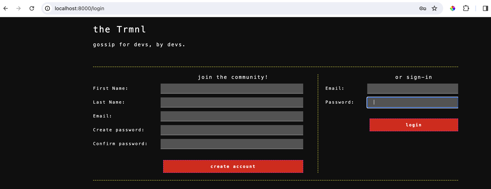
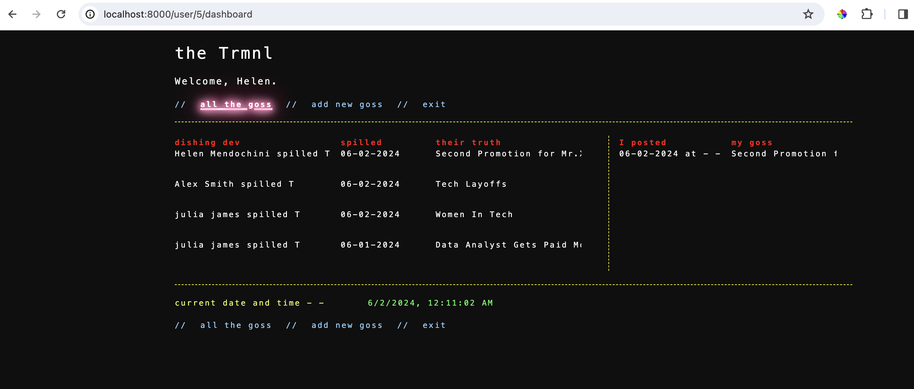
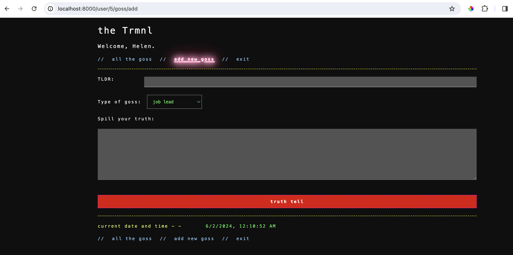
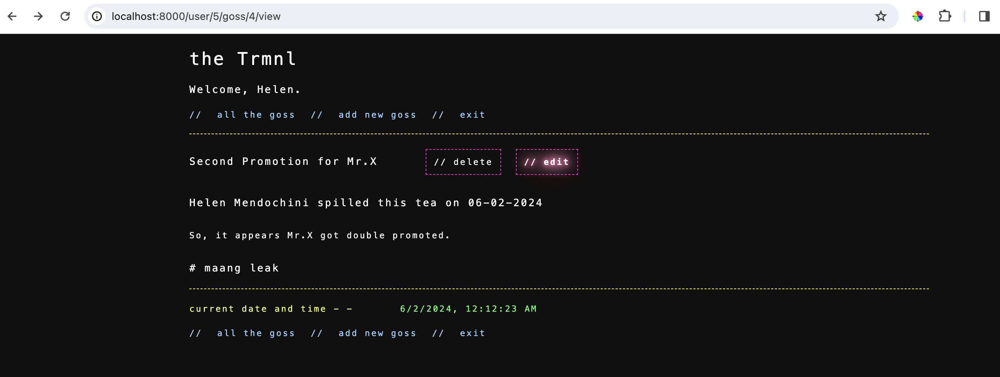
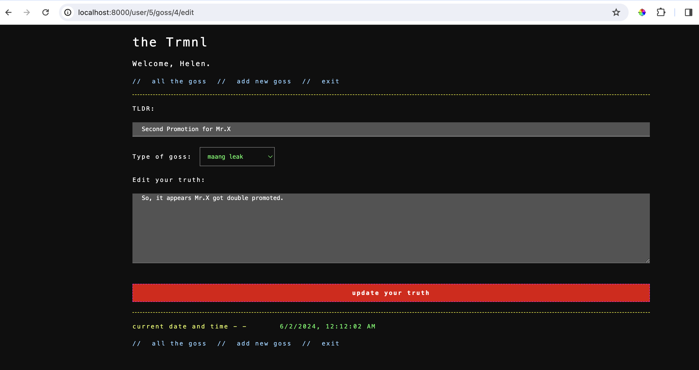
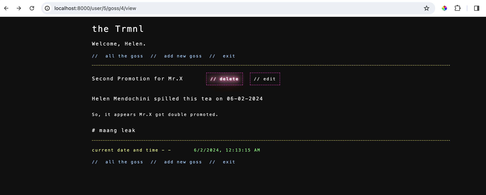

# Gossip Terminal

Live Demo Site
#
## Description
“The Terminal" is a web-based application where Developers come together online to share hot, yet vital gossip about their industry.
This MVP includes a way for users to safely sign up and login (Regex, hashing + salt with Bcrypt, and validations).
Once signed in, users will find a dashboard of posts created by other users. The dashboard will include links to pages where they can 
create/ edit/ delete posts, and logout. The posts can also each be viewed on their own, in their entirety by anyone logged in.

## Features
Secure login/ registration with validations and errors flashed (all fields, mins and maxes, email in
the correct format, etc.)
Full CRUD with a ‘users’ table and a ‘posts’ table.
Protected routes: users must be logged in to view posts. Only post creators can edit or delete their
posts.
CSS (vanilla CSS with maybe a Tailwind or Tachyons framework component or two, esp. tables)
Additional static content such as a logo handmade in Adobe Illustrator and possibly some

## Registration and Login page

## Dashboard Page
This shows all the gossips of the users in the platform. It also includes the date and the category that it belongs to.

## Add Gossip Page

## Update Gossip Page
The below screenshot shows how the user can access the edit gossip page. Only the creator of the gossip can access this page.

This is the edit gossip page

## Delete Gossip Page

